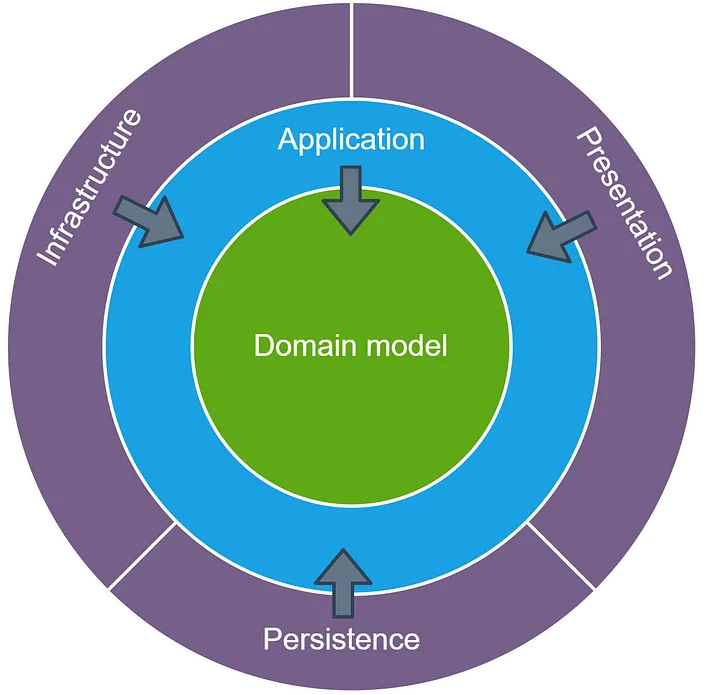

# Onion Architecture

[Первоисточник Jeffrey Palermo 2008](https://jeffreypalermo.com/2008/07/the-onion-architecture-part-1/)

Луковая архитектура — это архитектурный шаблон программного обеспечения, 
который обеспечивает модульную и слабосвязанную конструкцию, 
уделяя особое внимание разделению задач и удобству сопровождения. 
Это помогает разработчикам создавать более гибкие приложения,  
которые просто тестировать и, как следствие, такой приклад легче развивать с течением времени. 
В этой статье мы углубимся в ключевые концепции луковой архитектуры и предоставим пример структуры папок, иллюстрирующий ее реализацию.

#  Ключевые концепции Луковой Архитектуры
В самом центре мы видим модель предметной области, которая представляет собой комбинацию состояния и поведения, 
моделирующую истину для организации. 
Вокруг модели предметной области существуют другие уровни приложения. 
Количество слоев в ядре приложения может различаться, но помните, что модель предметной области — это самый центр, 
а поскольку все связи направлены к центру, **модель предметной области связана только сама с собой**. 

На первом уровне модели предметной области обычно мы находим интерфейсы, обеспечивающие сохранение и извлечение объектов, 
В примере кода эти интерфейсы представлены Шлюзами(ClientGateway, WalletGateway)
называемые интерфейсами репозитория. 
Однако поведение сохранения объектов (ClientGateway) не является ядром приложения, 
поскольку оно обычно задействует базу данных. 

В ядре приложения находится только интерфейс для работы с этим слоем. 
По краям мы видим пользовательский интерфейс, инфраструктуру. 
Внешний слой предназначен для вещей, 
которые часто меняются. 
Например, мы используем интерфейс командной строки, чтобы запустить бизнес-процесс,
мы можем легко доработать приложение и добавим REST интерфейc, а для консоли напишем адаптер работы с рестом.
Эти вещи следует намеренно изолировать от ядра приложения. 
На краю мы найдем класс, реализующий интерфейс репозитория. 
Этот класс привязан к определенному методу доступа к данным и поэтому находится вне ядра приложения. 
Этот класс реализует интерфейс репозитория и, таким образом, связан с ним.

## Правило зависимости:



Зависимости текут внутрь, при этом внутренние уровни не имеют информации о внешних слоях. Это гарантирует, что модули высокого уровня не зависят напрямую от модулей низкого уровня. Вместо этого оба зависят от абстракций, что обеспечивает взаимозаменяемость реализаций и уменьшает связанность.

## Слои
- Слой Предметной Области (Domain Layer): Содержит основную бизнес-логику и бизнес-правила приложения.    
- Уровень инфраструктуры (Infrastructure Layer): Управляет внешними для приложения зависимостями, такими как базы данных, файловые системы или внешние службы (Web-сервисы).  
- Уровень представления (Presentation Layer):  Управляет пользовательскими интерфейсами и логикой, связанной с представлением. Точка входа нашего приложения. Например, REST Controller, терминал.


## База данных не является центром. Это внешний слой.

Вынесение наружу базы данных может стать значительным изменением для некоторых людей, 
привыкших думать о приложениях как о «приложениях баз данных». В луковой архитектуре нет приложений баз данных. Существуют приложения, которые могут использовать базу данных в качестве службы хранения, но только через некоторый код внешней инфраструктуры, реализующий интерфейс, имеющий смысл для ядра приложения. Отделение приложения от базы данных, файловой системы и т. д. снижает стоимость обслуживания на протяжении всего срока службы приложения.

Alistair Cockburn написал о [гексагональной архитектуре](http://alistair.cockburn.us/index.php/Hexagonal_architecture) 
Шестиугольная архитектура и луковая архитектура имеют общую предпосылку: вынести инфраструктуру наружу и написать код адаптера, чтобы инфраструктура не становилась тесно связанной.

## Разделение границ
Каждый уровень имеет четкую ответственность, гарантируя, 
что бизнес-логика остается отделенной от проблем инфраструктуры или представления. 
Такое разделение повышает удобство сопровождения кода и облегчает тестирование.

## Пример структуры папок:

### Слой предметной-области (Domain Layer):

> src/domain/model #бизнес правила (business-rules)


### Уровень приложения (Application Layer):

> src/application/service
> src/application/usecase

Реализует бизнес-процесс (use-case). 
Управляет взаимодействием между уровнями предметной области и инфраструктуры 
по шагам бизнес-процесса.

### Уровень инфраструктуры (Infrastructure Layer)

Обрабатывает внешние зависимости и технические детали.
Примеры папок: 

>src/infrastructure/persistence
>src/infrastructure/service #rest, queue

 

 
## Преимущества луковой архитектуры:
### Модульность и Простота сопровождения:
Четкое разделение задач и разделение зависимостей упрощают сопровождение и модификацию кода, 
делая его более адаптируемым к меняющимся требованиям.

### Тестируемость:
Каждый уровень может быть протестирован независимо. 
Позволяет проводить комплексные модульные тесты и гарантировать, 
что бизнес-логика остается изолированной от внешних зависимостей и **покрыта 100% юнит-тестами**.

### Гибкость
Модульная конструкция облегчает внедрение новых фрэймворков и инструментов (переход с IBM MQ, Kafka), 
не затрагивая бизнес-логику,  
повышая масштабируемость и устойчивость приложения.


----

# Пример приложения в исходнике

По шагам что мы делаем на каждом слое

## 1. Уровень представления
### Какую проблему решает:  
Является Точкой входа в приложение. Инициирует исполнение бизнес-сценария.  

Это тот уровень, который выставляет публичный API
- терминал
- REST API
- Подписка на очередь сообщений
- и т.п. RPC

В нашем примере это: [TerminalApp.kt](src%2Fmain%2Fkotlin%2Fteam%2Fcodemonsters%2Fcode%2FwalletRegistration%2Fpresentation%2FTerminalApp.kt)

В такой архитектуре легко добавить любую точку входа.

### Что делаем на этом уровне?
1. Получаем запрос извне (ДТО)
2. Формируем из ДТО валидный запрос для сервиса приложения   
     валидируем запрос согласно бизнес-правилам доменной модели, которые описаны в API сервиса приложения.
     Транслируем результат ошибки при валидации в понятный ответ нашего API  
3. Передаем управление сервису приложения  
4. Транслируем результат работы сервиса в понятный ответ согласно API  

[WalletRegistrationService.kt](src%2Fmain%2Fkotlin%2Fteam%2Fcodemonsters%2Fcode%2FwalletRegistration%2Fapplication%2FWalletRegistrationService.kt)


## 2. Уровень приложения
Сервис приложения и шлюзы

## 2.1 Сервис приложения
### Какую проблему решает:

Сервис приложения реализует бизнес-сценарий по шагам.
Взаимодействует с консистентными моделями предметной области в которых описаны бизнес-правила
и передает управление на уровень инфраструктуры через Шлюзы, чтобы получить модели предметной области и передать их в уровень хранения.

#### Клас сервиса:  
Сервис Регистрации Кошелька
[WalletRegistrationService.kt](src%2Fmain%2Fkotlin%2Fteam%2Fcodemonsters%2Fcode%2FwalletRegistration%2Fapplication%2FWalletRegistrationService.kt)  

### Что делаем на этом уровне?
1. Выполняем шаги бизнес-сценария
2. Получаем нужные данные из шлюзов в виде моделей предметной области
3. Отправляем данные в шлюзы на сохранение или для запуска исполнения внешнего процесса по бизнес-сценарию в виде моделей предметной области

## 2.2 Шлюзы: 
Шлюзы обеспечивают взаимодействие с внешними системами (веб сервисы, очереди, и т.п.) 
и уровнем хранения (база данных)
[ClientGateway.kt](src%2Fmain%2Fkotlin%2Fteam%2Fcodemonsters%2Fcode%2FwalletRegistration%2Fapplication%2FClientGateway.kt)  
Для чего:
1. Чтобы получить модели предметной области
2. Чтобы передать модели предметной области во внешний мир

### Что делаем на этом уровне?
Делаем только то, что нужно по бизнес-процессу.

#### Получаем данные для сервиса приложения:

ClientGateway:: findClient

1. Получаем запрос из Сервиса Приложения в виде модели предметной области
2. Транслируем запрос из модели предметной области в соответствующий запрос для инфраструктурного сервиса (DTO, DB Entity)
3. Передаем запрос в инфраструктурный сервис
4. Транслируем ответ от инфраструктурного сервиса (DTO, DB Entity) в консистентную модель предметной области
5. Возвращаем ответ в виде модели предметной области [domain](src%2Fmain%2Fkotlin%2Fteam%2Fcodemonsters%2Fcode%2FwalletRegistration%2Fdomain)

#### Отправляем данные из сервиса приложения, например сохраняем модель в базе данных.

ClientGateway:: registerWallet

1. Получаем запрос из Сервиса Приложения в виде модели предметной области
2. Транслируем запрос из модели предметной области в соответствующий запрос для инфраструктурного сервиса (DTO, DB Entity)
3. Передаем запрос в инфраструктурные сервис
4. Транслируем ответ от инфраструктурного сервиса в консистентную модель предметной области
5. Возвращаем ответ в виде модели предметной области [domain](src%2Fmain%2Fkotlin%2Fteam%2Fcodemonsters%2Fcode%2FwalletRegistration%2Fdomain)

## 3. Уровень инфраструктуры
### Какую проблему решает:
Обеспечивает взаимодействие с внешним миром для нашего приложения.

### Что делаем на этом уровне?

1. Интеграция с Базой Данных:  
   [ClientRepository.kt](src%2Fmain%2Fkotlin%2Fteam%2Fcodemonsters%2Fcode%2FwalletRegistration%2Finfrastructure%2FClientRepository.kt)

2. Клиенты для взаимодействия с веб-сервисами по REST API

3. Клиенты для взаимодействия с брокерами сообщений

4. Клиенты для работы с файлами.


## 4. Уровень модели предметной области (domain layer)
[domain](src%2Ftest%2Fkotlin%2Fteam%2Fcodemonsters%2Fcode%2FwalletRegistration%2Fdomain)

На этом уровне мы моделируем бизнес-процесс. 
Описываем бизнес-правила в объектах-значениях [ClientId.kt](src%2Fmain%2Fkotlin%2Fteam%2Fcodemonsters%2Fcode%2FwalletRegistration%2Fdomain%2FClientId.kt) 
и описываем более сложные отношения моделей в агрегирующих моделях
[WalletRegistrationRequest.kt](src%2Fmain%2Fkotlin%2Fteam%2Fcodemonsters%2Fcode%2FwalletRegistration%2Fdomain%2FWalletRegistrationRequest.kt)


### Какую проблему решает:
Моделирования и тестирования бизнес-логики (use-case, business-rules)

### Что делаем на этом уровне?
Описываем модели предметной области, бизнес-правила в моделях и отношения моделей.
Гарантируем изоляцию моделей предметной области от инфры.

Модели предметной области знают только о моделях предметной области.

### Протечка:
[Client.kt](src%2Fmain%2Fkotlin%2Fteam%2Fcodemonsters%2Fcode%2FwalletRegistration%2Fdomain%2FClient.kt)
````kotlin
data class Client(
    val clientId: ClientId,
    val name: Name,
    val walletId: WalletId
) {

    companion object {
        fun emerge(entity: ClientEntity): Result<Client> {
            val clientId = ClientId.emerge(entity.id)
            if (clientId.isFailure)
                return Result.failure(clientId.exceptionOrNull()!!)

            val name = Name.emerge(entity.clientName)
            if (name.isFailure)
                return Result.failure(name.exceptionOrNull()!!)

            lateinit var walletId: WalletId
            if (null == entity.walletId) {
                walletId = WalletId.Empty
                return Result.success(Client(clientId.getOrThrow(), name.getOrThrow(), walletId))
            }

            val walletIdResult = WalletId.emerge(entity.walletId)
            if (walletIdResult.isFailure)
                return Result.failure(walletIdResult.exceptionOrNull()!!)
            walletId = walletIdResult.getOrThrow()

            return Result.success(Client(clientId.getOrThrow(), name.getOrThrow(), walletId))

        }
    }
}
````
Модель предметной области знает о сущности базы данных, которая поступает на вход в метод emerge, это нарушает изоляцию модели от внешнего мира.
