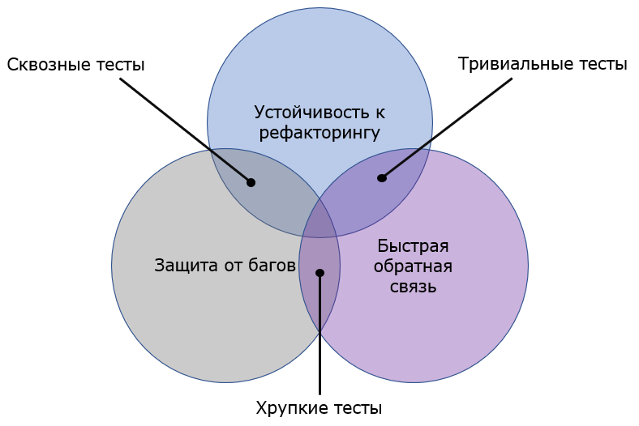
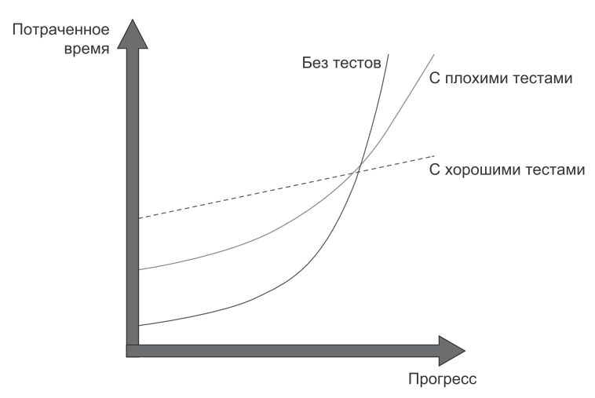
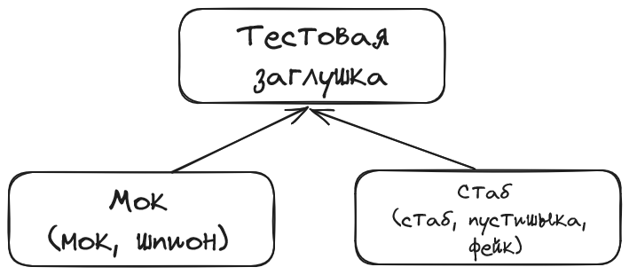
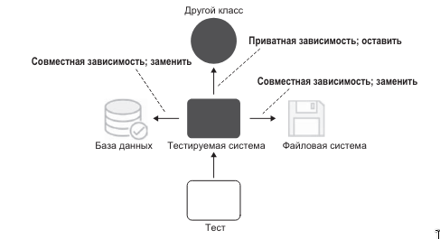
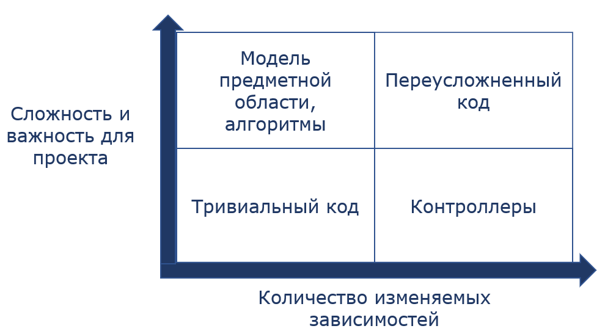

# Тесты

Важно стремиться к тому, чтобы свести к минимуму
усилия, потраченные на написание тестов, и максимизировать преимущества, которые они приносят.
Совместить эти две задачи не так просто.

> Необходимость писать юнит-тесты обычно приводит к улучшению качества кода. Но
это не главная цель юнит-тестирования, а всего лишь приятный побочный эффект.


> Тесты помогают справиться с деградацией кодовой базы. 
> Они становятся своего рода «подушкой безопасности» — средством, которое обеспечивает защиту против большинства регрессий. 

> Тесты помогают удостовериться в том, что существующая функциональность работает даже после разработки новой функциональности или рефакторинга кода.

Включайте в проект только наиболее эффективные тесты и избавляйтесь от всех остальных. 
И код приложения, и код тестов — обязательство, а не актив (liabilities, not assets).

При этом тесты это не то, что делается "на сдачу" - это такой же важный код, который нужно писать читамо и поддерживаемо, т. к. тесты
будут развиваться как часть кодовой базы.

Стоит понимать, что идеальных тестов не бывает и нужно подбирать виды тестирования, которую принесут вам максимальную пользу.



Целью тестирования является обеспечение стабильного роста проекта.
Хорошие тесты помогают предотвратить стагнацию и сохранить темп разработки со временем.



## Постоянный Рефакторинг
Постоянный рефакторинг кодовой базы, улучшение модели, тестов - это лучшая практика, которую инженер применяет каждый день.
Нужно принять тот факт, что мы постоянно находимся в процессе рефакторинга и привнесения улучшений. Тесты помогают нам в этом.

## Стандарт для тестов

Подходы:
- используем паттерн AAA - [Arrange/Act/Assert](TESTING.md#aaa---arrangeactassert);
- [одно утверждение на один тест](TESTING.md#одно-утверждение-на-один-тест);
- [тестируем поведение системы](TESTING.md#тестируем-поведение-системы) - опираемся на входные и выходные данные, а не детали имплементации;
- [названия тестов соответствуют проверяемому факту](TESTING.md#названия-тестов-соответствуют-проверяемому-факту);
- [используем "мягкие утверждения"](TESTING.md#используем-мягкие-утверждения);
- минимизируем использование [моков'ов](TESTING.md#моки);
- пишем юнит-тесты в стиле [классической школы](TESTING.md#что-принимаем-за-юнит);
- не ставим [покрытие](TESTING.md#метрики-покрытия-тестами) как самоцель, достигаем принятых стандартов покрытия с помощью [эффективных unit-тестов](TESTING.md#эффективные-юнит-тесты) и эффективных интеграционных тестов.

Технологии:
- используем [JUnit5](https://junit.org/junit5/) как движок для тестов;
- используем [AssertJ](https://assertj.github.io/doc/) для утверждений.

## Общие рекомендации

### AAA - Arrange/Act/Assert

Все юнит-тесты должны строиться по схеме ААА или Given-When-Then как альтернатива: подготовка(Arrange, Given), действие(Act, When), проверка(Assert, Then).
Такой подход повышает читаемость тестов и даёт им чёткую структуру, которая является стандартом в индустрии.

```java
import org.assertj.core.api.Assertions;
import ru.example.ArithmeticOperation;

import java.util.Arrays;
import java.util.List;

public class ArithmeticOperationTest {

    // В реальности комментарии для каждой из секций не нужны
    // Общепринятая практика разделять эти части пустыми строками
    @Test
    public void addition() {
        // Arrange
        ArithmeticOperation arithmeticOperation = new ArithmeticOperation();

        // Act
        int sum = arithmeticOperation.addition(1, 1);

        // Assert
        Assertions.assertThat(2).isEqualTo(sum);
    }
}
```

Секция подготовки, как правило, самая большая, в то время как Act и Assert должны быть максимально компактными.

### Одно утверждение на один тест

Такой подход позволяет сосредоточиться на том, какое поведение проверяется в тесте, а также улучшает его читаемость.

```java
import org.assertj.core.api.Assertions;
import org.junit.jupiter.api.DisplayName;
import ru.example.ComplexLogicService;

import java.util.Arrays;
import java.util.List;

public class ComplexAssertionTest {
    @Test
    public void complexWorkIsNotProcessedByWorker() {
        WorkerService complexLogicService = new WorkerService();

        WorkResult result = worker.doALotOfProcessing(new ComplexWork());

        assertComplexLogicDoneCorrectly(result);
    }
    
    private void assertComplexWorkIsNotProcessedByWorker(WorkResult workResult) {
        Assertions.assertThat(result.isSuccessful()).isFalse();
        Assertions.assertThat(result.getError().getMessage()).isEqualTo("Работа слишком сложная");
    }
}
```

### Тестируем поведение системы

Отталкиваемся от того, что передаём на вход и что получает на выход. Тестирование деталей имплементации ведёт к хрупким тестам, которые
надо перерабатывать при любом рефакторинге.

Это также называется тестирование методом "чёрного ящика" (black box). Хоть мы и сами написали код, мы должны проверять его так, будто не знаем, что внутри. 

```java
import org.junit.jupiter.api.Test;
import ru.example.BankingService;
import ru.example.Account;
import ru.example.TransactionLogger;

import java.math.BigDecimal;

public class BankingServiceTest {
    @Test
    public void successfulTransactionFromAccountWithEnoughMoney() {
        Account fromAccount = new Account("12345", BigDecimal.valueOf(1000));
        Account toAccount = new Account("54321", BigDecimal.valueOf(500));
        BankingService bankingService = new BankingService(new TransactionLogger());

        boolean isTransferSuccessful = bankingService.transferMoney(fromAccount, toAccount, BigDecimal.valueOf(500));

        Assertions.assertThat(isTransferSuccessful).isTrue();
    }
}
```

### Названия тестов соответствуют проверяемому факту

Названия тестов соответствуют тому факту, который проверяется в тесте, а не тому, как реализован код или какой метод используется.

`isAccountValidOnNegativeBalanceReturnsFalse` - неудачное название теста.
`accountWithNegativeBalanceIsInvalid` - удачное название теста.

Также хорошей практикой является использование аннотации @DisplayName, значение которой будет использоваться как имя теста в прогонах и отчётах.

```java
    @Test
    @DisplayName("Счёт с отрицательным балансом невалиден")
    public void accountWithNegativeBalanceIsInvalid() {
        // опущено для краткости
    }
```

### Используем "мягкие" утверждения

"Мягкие" утверждения (Soft Assertions) помогают не "падать" после первой неудачной проверки, а провести все проверки, после чего
вывести результат всех проверок, даже если некоторые из них были неуспешными. Это часто помогает лучше понять, почему тест упал, не прибегая к повторным запускам
или дебагу.

Пример с использование SoftAssertions библиотеки AssertJ
```java
// Даже если упадёт первая проверка, то мы получим информацию обо всех проверках
private static void assertSomeAccountBalanceLogic(boolean isSuccessful, Balance balance, Account account) {
            SoftAssertions.assertSoftly(softly -> {
                        softly.assertThat(isSuccessful).isTrue();
                        softly.assertThat(balance).isGreaterThan(BigDecimal.valueOf(0));
                        softly.assertThat(account.isClosed()).isFalse();
                    }
            );
        }
```
### Метрики покрытия тестами

Метрики покрытия не могут стать основой для определения качества тестов в вашем проекте.
Лучше всего рассматривать метрику покрытия как индикатор, а не как самоцель.
Метрики покрытия служат хорошим негативным, но плохим позитивным признаком.
Низкий процент покрытия — хороший признак проблем с тестами, но высокий процент покрытия еще не означает высокого
качества тестов.

Установление конкретного процента покрытия как цели создает неправильный
стимул. Обеспечивать высокий процент покрытия для основных частей вашей
системы хорошо, но не следует превращать этот высокий процент в требование.

### Моки



## Unit-тесты

### Что такое юнит-тест?

Юнит-тестом называется автоматизированный тест, который:
- проверяет правильность работы небольшого фрагмента кода (также называемого юнитом);
- делает это быстро
- и поддерживая изоляцию от другого кода.

### Затраты на юнит-тесты
- рефакторинг теста при рефакторинге кода;
- выполнение теста при каждом изменении кода;
- отвлечение на ложные срабатывания теста;
- затраты на чтение теста при попытке понять, как работает код.

### Что принимаем за юнит?

Принимаем понятие unit из классической школы. Классическая школа как путь к эффективным тестам.

Вопрос изоляции — это корень различий между классической и лондонской школой юнит-тестирования.

Лондонская школа описывает это как изоляцию тестируемого кода от его зависимостей.
Это означает, что если класс имеет зависимость от другого класса или нескольких классов, все такие зависимости должны быть заменены на тестовые заглушки (test doubles).
Лондонский стиль рассматривает вопрос изоляции как отделение тестируемого кода от его коллабораторов с помощью моков.

В классическом подходе изолируются друг от друга не фрагменты рабочего кода, а сами тесты.
Такая изоляция позволяет вам запускать эти тесты параллельно, последовательно и в любом порядке, не влияя на результат работы этих тестов.

Классический подход к изоляции не запрещает вам тестировать несколько классов одновременно,
при условии что все они находятся в памяти и не обращаются к совместному состоянию (shared state),
через которое тесты могут влиять на результат выполнения друг друга.
Типичными примерами такого совместного состояния служат внепроцессные (out-of-process) зависимости — база данных,
файловая система и т. д.



Юнит не обязан ограничиваться классом.
Вы можете юнит-тестировать как один класс, так и несколько классов, при условии,
что ни один из них не является совместной зависимостью.

### Эффективные юнит-тесты

Успешный набор тестов обладает следующими свойствами:
- он интегрирован в цикл разработки;
- он проверяет только самые важные части вашего кода;
- он дает максимальную защиту от багов с минимальными затратами на сопровождение.

Самой важной часть кодовой базы является та, которая содержит бизнес-логику — модель предметной области (доменная модель). 
Тестирование бизнес-логики обеспечивает тестам наилучшую эффективность.
Все остальные части можно разделить на три категории:
- инфраструктурный код;
- внешние сервисы и зависимости — например, базы данных и сторонние системы;
- код, связывающий все компоненты воедино.



## Интеграционные тесты

В отличие от юнит-тесты, которые покрывают доменную модель и бизнес-правила, интеграционные тесты проверяют код, связывающий доменную модель с внепроцессными зависимостями.
Используйте интеграционные тесты для покрытия одного позитивного пути, а так же всех пограничных случаев, которые не могут быть покрыты юнит-тестами.

Используйте реальные экземпляры управляемых зависимостей (например: база данных) в интеграционных тестах; заменяйте неуправляемые зависимости (например: SMTP-сервер) моками.

### Общие рекомендации по интеграционным тестам

Эффективно использовать интеграционные тесты возможно в системе где:
- явно определены границы модели предметной области;
- минимально количество слоев;
- отсутствуют циклические зависимости;
- определены интерфейсы для неуправляемых зависимостей.

Четкая граница между классами предметной области и контроллерами помогает отличать юнит-тесты от интеграционных.

### Технологии для интеграционных тестов

- используем [SpringBootTest](https://mvnrepository.com/artifact/org.springframework.boot/spring-boot-starter-test) для интеграционных тестов для работы с контекстом Spring и готовых решений для тестирования;
- [Testcontainers](https://java.testcontainers.org/) для поднятия внепроцессных зависимостей;
- [Awaitility](http://www.awaitility.org/) для тестирования асинхронных взаимодействий.

## Рекомендации

Про практику AAA можно прочитать в статье Владимира Хорикова [Making Better Unit Tests: part 1, the AAA pattern](https://freecontent.manning.com/making-better-unit-tests-part-1-the-aaa-pattern/)     
Про практику Given-When-Then можно прочитать в статье Мартина Фаулера [Given When Then](https://martinfowler.com/bliki/GivenWhenThen.html)   

Книга Владимира Хорикова [“Принципы Юнит-Тестирования”](https://www.piter.com/product/printsipy-yunit-testirovaniya)  
Доклад про TDD от Ion Cooper’а [TDD, Where Did It All Go Wrong (Ian Cooper)](https://youtu.be/EZ05e7EMOLM?si=yqwTM7NB-Bbum2TV)   

[Сергей Егоров — TestContainers — интеграционное тестирование с Docker](https://youtu.be/PEVVvZOt7bY?si=7n3YSuTo6k38aiQU)  
[Testcontainers for Java](https://java.testcontainers.org/)  
[Testcontainers for Java / Files and volumes](https://java.testcontainers.org/features/files/)  
Статья Макса Морева и Ваганова Вадима про интеграционные тесты с использованием Testcontainers и Wiremock - [Гайд по чистому коду: учимся писать тесты](https://tproger.ru/articles/gajd-po-chistomu-kodu-uchimsya-pisat-testy)   

