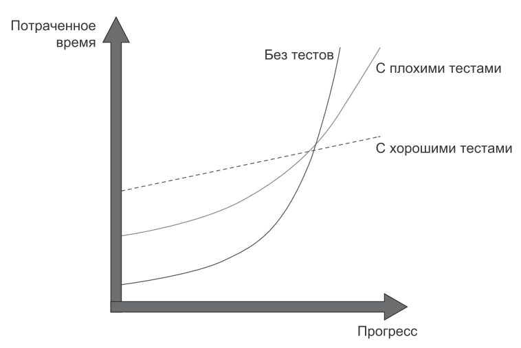

# Общие принципы тестирования

Целью тестирования является обеспечение стабильного роста проекта. 
Хорошие тесты помогают предотвратить стагнацию и сохранить темп разработки со временем. С такими тестами вы будете уверены в том, что изменения не приведут к багам. 
В свою очередь это упростит рефакторинг кода или добавление новой функциональности.

## Тестируйте поведение

Тесты не должны проверять единицы кода, они должны проверять единицы поведения.

Используйте тестирование по принципу "черного ящика" при написании тестов. Используйте тестирование по принципу "белого ящика" при анализе тестов.

## Пишите эффективные тесты

Не все тесты одинаково полезны. Включайте в проект только наиболее эффективные тесты и избавляйтесь от всех остальных.
Код, содержащий сложную бизнес-логику, важнее инфраструктурого кода - ошибки в критичной для бизнеса функциональности наносят наибольший ущерб.

Возможность покрытия кода юнит-тестами - хороший критерий оценки качества этого кода, но он работает только в одном направлении. 
Это хороший негативный признак (если юнит-тестирование кода невозможно, значит, это код плохого качества), но плохой позитивный признак (возможность юнит-тестированя кода не гарантирует качество этого кода).

Метрики покрытия служат хорошим негативным, но плохим позитивным признаком. 
Низкий процент покрытия - хороший признак проблем с тестами, но высокий процент покрытия еще не означает высокого качества тестов.

Загрязнение кода - добавление кода, который необходим только тестирования. Это антипаттерн, потому что вспомогательный код смешивается с рабочим кодом, что повышает затраты на сопровождение последнего.

Использование времени в виде неявного контекста загрязняет рабочий код и усложняет тестирование. Внедряйте время в виде явной зависимости.

Необходимость в мокировании конкретного класса для сохранения части его функциональности явяется нарушением принципа единственной ответственности.
Разделите этот класс на два: один содержит логику предметной области, а другой - взаимодействие с внепроцессной зависимостью.

Успешные тесты обладают следующими свойствами:
- интегрированы в цикл разработки;
- проверяют самые важные части вашего кода;
- дают максимальную защиту от багов с минимальными затратами на сопровождение.

## Тестирование приватных методов

Тестируйте приватные методы не напрямую, а косвенно, как часть наблюдаемого поведения.

Если приватный метод слишком сложен для того, чтобы тестироваться как часть открытого API, в котором он используется, это указывает на недостаточную абстракцию.
Выделите эту абстракцию в отдельный класс, вместо того что бы делать приватный метод публичным.

Не меняйте область видимости приватного метода, ради удобства тестирования.

Не раскрывайте состояние, которое вы бы без этого предпочли оставить привытным, только ради юнит-тестирования. 
Ваши тесты должны взаимодействовать с тестируемой системой в точности так же, как и рабочий код; они не должны иметь особых привилегий.

## Полезные ресурсы
Книга Владимира Хорикова [“Принципы Юнит-Тестирования”](https://www.piter.com/product/printsipy-yunit-testirovaniya)  
Доклад про TDD от Ion Cooper’а [TDD, Where Did It All Go Wrong (Ian Cooper)](https://youtu.be/EZ05e7EMOLM?si=yqwTM7NB-Bbum2TV)

