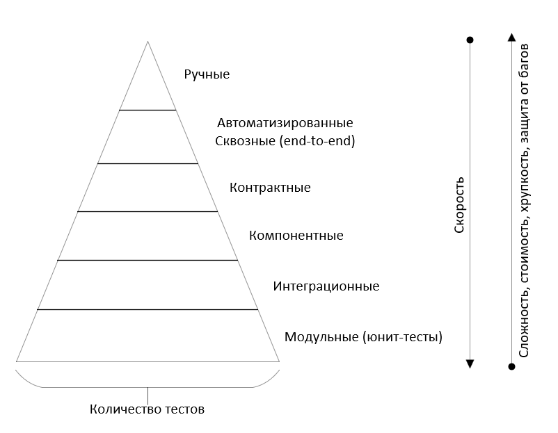

# Пирамида тестирования

Пирамида тестирования предписывает определенное соотношение юнит-, интеграционных, компонентных, контрактных, сквозных и ручных тестов.
Юнит-тестов должно быть больше всего, ручных - меньше всего.

Разные типы тестов в пирамиде принимают разные компромиссы между быстротой обратной связи и сложностью, стоимостью, защитой от багов. 
Сквозные тесты отдают предпочтение защите от багов, а юнит-тесты - быстрой обратной связи. 